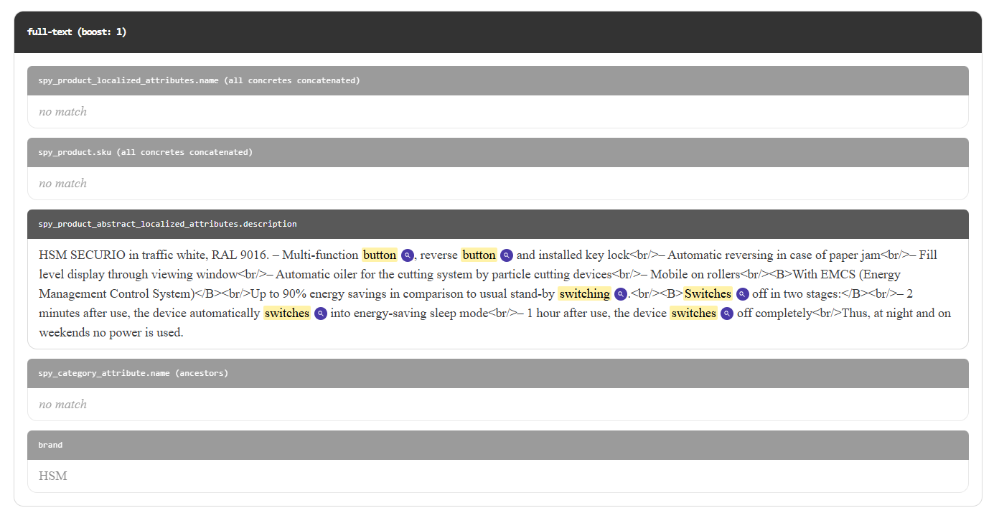
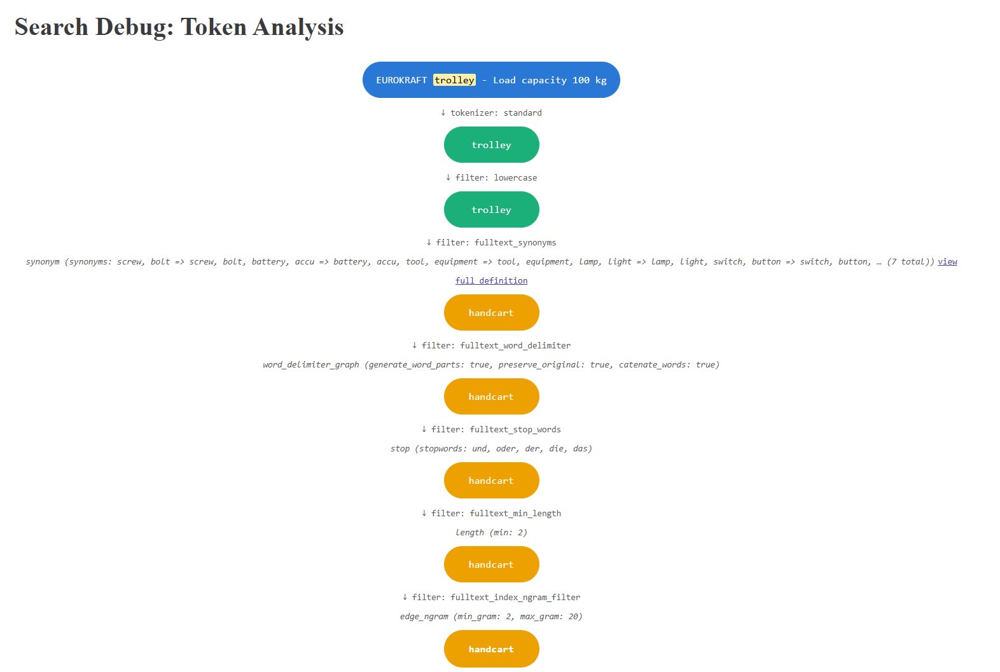

# Spryker Search DevTools

Developer tools for inspecting, debugging and understanding OpenSearch/Elasticsearch queries in Spryker.
Search Debug helps Search Engineers explain ranking decisions—quickly enough that they can confidently answer the business question: "Why did this product rank above that one?"

## Contents

- [What does this do?](#what-does-this-do)
- [Status](#status)
- [Search Debug — Spryker Community Extension](#search-debug-spryker-community-extension)
- [Requirements](#requirements)
  - [Search engine compatibility](#search-engine-compatibility)
- [Installation](#installation)
  - [1. Install the package](#1-install-the-package)
  - [2. Register the core namespace](#2-register-the-core-namespace)
  - [3. Generate transfers and clear caches](#3-generate-transfers-and-clear-caches)
  - [4. Register the plugins](#4-register-the-plugins)
  - [5. Register the Yves plugins](#5-register-the-yves-plugins)
  - [6. Hook up the storefront templates](#6-hook-up-the-storefront-templates)
  - [7. Frontend build](#7-frontend-build)
  - [8. Glossary entries](#8-glossary-entries)
  - [9. Grant the permission](#9-grant-the-permission)
  - [10. Verify the installation](#10-verify-the-installation)
- [How it works](#how-it-works)
- [Extending the overlay](#extending-the-overlay)
  - [Naming your own indexed values on the token-source page](#naming-your-own-indexed-values-on-the-token-source-page)
  - [Display precision](#display-precision)
- [Limitations](#limitations)
- [Testing and CI](#testing-and-ci)
  - [Automated checks](#automated-checks)
  - [Test suite](#test-suite)
- [License](#license)

## What does this do?

A permission-gated user browsing the storefront search results gets a per-product overlay with the real
Elasticsearch `_score`, which query tokens matched, and — one click deeper — the exact BM25 boost/idf/tf
numbers behind each match, pinned open for comparing two products side by side:


No more "because Elasticsearch said so" — every number on the page traces back to a real, inspectable part
of the query.

## Status

Feature-complete and verified for its scope: search relevance debugging, including per-token
analysis-path visualization. Pending a full code review before a 1.0 tag. More tools are planned.

Verified: dependency floors resolved and checked at their oldest allowed versions (`composer
check-floors`), explanation parsing confirmed against three engines across two Lucene generations (see
"Search engine compatibility"), 107 tests, phpcs and phpstan level 6 clean.

## Search Debug — Spryker Community Extension

Search relevance debugging for Spryker storefronts, on top of the standard Elasticsearch/OpenSearch
catalog search:

- **SRP score overlay** — permission-gated customers see, per product on the search results page, the raw
  Elasticsearch `_score`, the analyzer tokens of their query, and which tokens matched with which score
  contribution (parsed from the Elasticsearch `explain` tree into a compact per-token breakdown). A matched
  token scored by BM25Similarity expands into its own boost/idf/tf breakdown (document frequency, term
  frequency, field length vs. average field length — every number BM25 actually computes with), collapsed
  behind its own toggle so the headline total stays the default view. The overlay stays open on click (a
  pin-toggle button, independent of continued hover) for copying values or comparing two products side by
  side.
- **Token-source page** — a magnifier next to each matched token opens a page that attributes the token
  back to the raw product fields it was indexed from (name, SKU, variants, descriptions, categories,
  merchant name). It reads the product's **real indexed document** and analyzes its elements with the
  **index-time analyzer**, so prefix/ngram matches (e.g. searching `öl` matching *Ölpapier*) and
  searchable-attribute contributions (Zed → Search Preferences) are attributed correctly — including
  values no known source claims, which are shown honestly as "other indexed value", carrying a `?`
  affordance that explains why and how to name them.

  
- **Analysis-path page** — a second magnifier next to each matched fragment on the token-source page opens
  a page showing exactly how that raw text became the matched token: one box per analyzer stage (char
  filters, the tokenizer, every token filter, in chain order), connected by the ES operation that produced
  each one — e.g. `Ölpapier` → *filter: lowercase* → `ölpapier` → *filter: fulltext_index_ngram_filter* →
  `öl`. Always a straight line, never a tree: even a filter that fans one token into several (ngram,
  decompounding, synonyms) only contributes the ONE step that actually led to the matched token — the
  path is reconstructed by walking backward through Lucene's own offsets (which stay relative to the
  original text across every stage), not by inspecting filter types, so it works for any analyzer chain.
  Each operation also shows that filter's own configuration, read live from the index's analysis settings
  (e.g. `filter: fulltext_index_ngram_filter` → `edge_ngram (min_gram: 2, max_gram: 20)`) — built-in
  components used by name only (`lowercase`, `standard`) show no definition, since nothing was customized.
  Every step is colored by its own exact text, cycling a fixed palette — the SAME text anywhere in the
  path gets the SAME color, so a color CHANGE between neighboring steps is itself the visual tell that a
  filter actually transformed the text (e.g. a synonym injecting a different word), not just decoration.

  
- **Component-config page** — when a filter's configuration is too long to show inline (a `stop`/`synonym`
  filter's word list can run into the hundreds), the analysis-path page's definition line shows a preview
  plus a "view full definition" link instead of dumping everything into one line. It opens a new tab
  showing that ONE component's config in full, re-fetched server-side by kind+name — nothing is smuggled
  through the URL.
- **Zero analyzer configuration** — analyzer names are resolved from the live index's mapping
  (`analyzer` / `search_analyzer` of the `full-text` field, with Elasticsearch's own fallback rules), not
  from config, so the package works with any `page.json` customization or the vanilla core schema.

Access is controlled through Spryker's permission system: only customers granted the
`SeeSearchDebugInfoPermissionPlugin` permission see any debug output. The permission is enforced in the
Client layer, so it also covers non-Yves entry points (e.g. the Glue catalog-search resource).

**On B2C shops, granting it needs one extra piece.** The permission *plugin* registers fine anywhere —
`spryker/permission` ships in B2C too, and the B2C demo shop already has a
`Pyz\Client\Permission\PermissionDependencyProvider` with a `getPermissionPlugins()` extension point. What
differs is how permissions are *assigned*. B2B assigns them per Company Role, so you grant this to one
role and only those users see the overlay. Stock B2C has no company roles: its only permission storage
plugin is `CustomerAccessPermissionStoragePlugin`, which resolves permissions purely from logged-in vs
logged-out state — so out of the box you could only grant this to *every* logged-in customer, which is
not what you want for a debug tool. A B2C shop therefore needs a small custom
`PermissionStoragePluginInterface` implementation that grants the permission to whichever customers it
should apply to (e.g. an allowlist of customer references).

## Requirements

- Spryker B2B/B2C/Marketplace shop on the `spryker/search-elasticsearch` stack
- PHP >= 8.3

Dependency floors are verified, not guessed: `composer update --prefer-lowest --prefer-stable` resolves
the declared constraints to their oldest allowed versions, and every vendor symbol the package references
is checked to exist in that tree. PHP 8.2 is *not* supported — `spryker/store` pulls `spryker/propel-orm`,
and every `propel-orm` release is either PHP >= 8.3 or depends on a non-stable `propel/propel`, so no
valid PHP 8.2 resolution exists.

### Search engine compatibility

**Verified against real `_explanation` output from all of:**

| engine | Lucene | result |
|---|---|---|
| OpenSearch 1.3.4 | 8.10.1 | ✅ |
| OpenSearch 2.11.0 | 9.7.0 | ✅ |
| Elasticsearch 8.11.0 | 9.8.0 | ✅ |

On each engine the parser was run against both the plain `cross_fields` multi_match shape and the
`function_score` + `script_score` shape, and on each it extracted the matched-token weights, the full
BM25 boost/idf/tf breakdown, and the pre-`function_score` relevance score identically — same values, to
the last digit, across both engine lineages and two Lucene generations.

Elasticsearch 7.x has not been run against real output, but sits inside the verified range: it is the
fork point OpenSearch 1.x descends from, and both neighbours on either side are verified.

That two-Lucene-generation span is worth something concrete: Lucene did change explain wording between
them (`dl, length of field (approximate)` in 8.10 became `dl, length of field` in 9.7). The parser reads
that node by prefix rather than exact string, so it kept working — which is the degradation posture
described below doing its job on a real version change rather than a hypothetical one.

This package reads `_explanation` trees and `_analyze` output, and stays deliberately inside the feature
set both engine lineages share. That subset is not arbitrary: Elasticsearch 7.10.2 (January 2021) was the
last Apache-2.0 release before the SSPL/Elastic License change, and OpenSearch was forked from exactly
that point. Anything at or below the fork exists in both lineages; anything Elastic added afterwards (the
`pinned` query, for instance) exists only in Elasticsearch. Staying inside the pre-fork subset is what
lets one package serve both.

The residual risk on an unverified engine is that the explanation parser matches on `_explanation` *node
description strings*, which Lucene produces and which can shift between Lucene versions (OpenSearch 1.3.4
ships Lucene 8.10.1; Elasticsearch 7.10.2 shipped Lucene 8.7.0). Unrecognized node shapes degrade
gracefully — they are kept verbatim as "other contributions" rather than dropped or mislabeled (see
`ExplanationParser`) — so the failure mode there is *less* detail, not wrong numbers.

## Installation

### 1. Install the package

```bash
composer require spryker-community/search-debug
```

### 2. Register the core namespace

Add `SprykerCommunity` to the core namespaces in `config/Shared/config_default.php`:

```php
$config[KernelConstants::CORE_NAMESPACES] = [
    'SprykerShop',
    'SprykerEco',
    'Spryker',
    'SprykerSdk',
    'SprykerFeature',
    'SprykerCommunity', // <- add this line
];
```

This makes the package's modules resolvable like core modules — and, like core modules, extendable from
your project namespace (e.g. `Pyz\Client\SearchDebug\SearchDebugConfig`).

### 3. Generate transfers and clear caches

```bash
vendor/bin/console transfer:generate
vendor/bin/console cache:empty-all
```

### 4. Register the plugins

`src/Pyz/Client/Catalog/CatalogDependencyProvider.php` — enable `explain` and the debug result data on
the catalog search query:

```php
use SprykerCommunity\Client\SearchDebug\Plugin\Catalog\SearchDebugQueryExpanderPlugin;
use SprykerCommunity\Client\SearchDebug\Plugin\Catalog\SearchDebugResultFormatterPlugin;

    protected function createCatalogSearchQueryExpanderPlugins(): array
    {
        return [
            // ... existing plugins, before FacetQueryExpanderPlugin
            new SearchDebugQueryExpanderPlugin(),
            new FacetQueryExpanderPlugin(),
        ];
    }

    protected function createCatalogSearchResultFormatterPlugins(): array
    {
        return [
            // ... existing plugins
            new SearchDebugResultFormatterPlugin(),
        ];
    }
```

`src/Pyz/Zed/Permission/PermissionDependencyProvider.php` **and**
`src/Pyz/Client/Permission/PermissionDependencyProvider.php` — make the permission assignable and
checkable:

```php
use SprykerCommunity\Shared\SearchDebug\Plugin\SeeSearchDebugInfoPermissionPlugin;

    protected function getPermissionPlugins(): array
    {
        return [
            // ... existing plugins
            new SeeSearchDebugInfoPermissionPlugin(),
        ];
    }
```

`src/Pyz/Yves/Router/RouterDependencyProvider.php` — register the token-source route:

```php
use SprykerCommunity\Yves\SearchDebugWidget\Plugin\Router\SearchDebugWidgetRouteProviderPlugin;

    protected function getRouteProvider(): array
    {
        return [
            // ... existing plugins
            new SearchDebugWidgetRouteProviderPlugin(),
        ];
    }
```

### 5. Register the Yves plugins

`src/Pyz/Yves/EventDispatcher/EventDispatcherDependencyProvider.php` — marks search-results requests as a
debug context for permitted customers:

```php
use SprykerCommunity\Yves\SearchDebug\Plugin\EventDispatcher\SearchDebugContextEventDispatcherPlugin;

    protected function getEventDispatcherPlugins(): array
    {
        return [
            new SearchDebugContextEventDispatcherPlugin(),
            // ... existing plugins
        ];
    }
```

`src/Pyz/Yves/Twig/TwigDependencyProvider.php` — provides the `searchDebugTokenColors()` template
function used in step 6:

```php
use SprykerCommunity\Yves\SearchDebug\Plugin\Twig\SearchDebugTwigPlugin;

    protected function getTwigPlugins(): array
    {
        return [
            new SearchDebugTwigPlugin(),
            // ... existing plugins
        ];
    }
```

**No controller override is required.** Earlier versions of this package asked you to extend your own
`CatalogController` to set the debug context and compute token colours. That was the most invasive part
of installing it, and a guaranteed merge for the many shops that already override that controller —
so both jobs moved into the two plugins above.

The listener works because the core `CatalogController` builds its search parameters from
`$request->query`, and its `reduceRestrictedParameters()` only strips *price* parameters — it does not
whitelist, so a parameter set before the controller runs survives into `catalogSearch()`. Security is
unchanged: the parameter never was the gate. It only marks "this is a search-results page", while
`SearchDebugAccessChecker` independently re-checks the permission in the Client layer before any debug
data is produced. The listener also unconditionally strips any incoming value of that parameter first, so
a crafted URL cannot smuggle one in.

### 6. Hook up the storefront templates

In your search view (e.g. a project `search.twig`), map the raw `_view.searchDebug.*` result data (nested
under the `SearchDebugResultFormatterPlugin::NAME` key) into flat `data.*` entries alongside your other
view data:

```twig

```

Then render the query-token headline:

```twig

```

In your product-grid template (e.g. `page-layout-catalog.twig`), render the per-product overlay inside
the product loop — `fieldBoosts` is the query's real, live field=>boost pairs (captured by
`QueryFieldBoostReader`, e.g. `{'full-text': 1, 'full-text-boosted': 5}`), forwarded through the
per-token link so the token-source page shows however many fields your query actually searched, at their
real boost values, with no hardcoded field count or boost assumption:

```twig


    

```

### 7. Frontend build

Add the community vendor directory to your Yves builder so the package's components compile. In
`frontend/settings.js`, add to `paths`:

```js
community: './vendor/spryker-community',
```

...mirror it in the per-theme path mapping, and add `join(globalSettings.context, paths.community)` to
`find.componentEntryPoints.dirs`. Then:

```bash
yarn yves
```

### 8. Glossary entries

Copy the rows from this package's [`data/glossary.csv`](data/glossary.csv) into your project's own
`glossary.csv` (e.g. `data/import/common/common/glossary.csv`) — every `search_debug.*` key the package
references, already translated for `en_US`/`de_DE`. Edit the translated text or add further locales as
your project needs; nothing about the KEYS themselves is project-specific. Then re-run:

```bash
vendor/bin/console data:import glossary
```

### 9. Grant the permission

In Zed → Customer → Company Roles, assign the **SeeSearchDebugInfoPermissionPlugin** permission to a
dedicated role (recommended: a separate "Search Admin" role rather than widening an existing admin
role), and assign that role to the users who should see debug output.

### 10. Verify the installation

```bash
vendor/bin/console search-debug:check-installation
```

Most of the steps above fail *silently* when missed — the overlay simply does not appear, with nothing in
any log to say why. This command checks the core namespace registration, that every plugin class is
loadable, that the search engine is reachable (reporting its distribution and Lucene version), that a
page index exists, and that the engine really returns `_explanation` data. It exits non-zero and names the
remedy for whatever is wrong.

It is explicit about its own blind spots: running in Zed, it never bootstraps the Yves DI container, so it
cannot confirm that you registered the EventDispatcher/Twig plugins from step 5, the widget routes from
step 4, or wired the templates in step 6 — it says so in its output.

Register it in `src/Pyz/Zed/Console/ConsoleDependencyProvider.php`:

```php
use SprykerCommunity\Zed\SearchDebug\Communication\Console\SearchDebugCheckInstallationConsole;

    protected function getConsoleCommands(Container $container): array
    {
        return [
            // ... existing commands
            new SearchDebugCheckInstallationConsole(),
        ];
    }
```

**Yves-side counterpart.** `/search-debug/check-installation` closes exactly the gap the console command
names above — it runs from inside the real Yves DI container (no new plugin registration needed, it uses
the same `SearchDebugWidgetRouteProviderPlugin` from step 4), and checks: the Twig helper function from
step 5, the event listener from step 5, and the three widget routes from step 4. It is complementary, not
a replacement: it does not re-check engine reachability, the page index, or explain support — run the
console command for those. Together the two cover everything except the two things neither can prove
generically — your project's own template wiring (step 6) and whether the frontend build picked the
components up (step 7) — which stay a load-the-page check either way.

Reachable only when BOTH hold:

- The route exists at all — governed by
  `SprykerCommunity\Shared\SearchDebug\SearchDebugConstants::IS_CHECK_INSTALLATION_PAGE_ENABLED`, which
  defaults to enabled. **Set it to `false` in your production config** (e.g.
  `config/Shared/config_default-production.php`):

  ```php
  $config[SearchDebugConstants::IS_CHECK_INSTALLATION_PAGE_ENABLED] = false;
  ```

  With the flag off, the route never registers there, so the URL 404s in production exactly like any
  nonexistent path — regardless of permission. A permission check alone would still leak "this route
  exists and is gated" to an anonymous prober; not registering the route at all removes that signal
  entirely. This is deliberately a config flag rather than the package auto-detecting an environment name
  — the same idiom Spryker's own `WebProfilerConstants::IS_WEB_PROFILER_ENABLED` uses, since environment
  names and what counts as "production" vary per project, and guessing wrong in either direction is worse
  than an explicit opt-out.
- The visiting customer holds the `SeeSearchDebugInfoPermissionPlugin` permission — checked wherever the
  flag above leaves the route enabled (e.g. staging), so enabling it outside production does not by itself
  expose the page to anyone but a permitted customer. Missing the permission there renders a dedicated
  explanation with the exact remedy (grant the permission, per step 9) at HTTP 403, rather than a bare
  access-denied response — someone hitting this page without the permission yet is almost always mid-setup,
  not an incident.

## How it works

- `SearchDebugQueryExpanderPlugin` switches Elasticsearch inline `explain` on — only when the request
  was flagged by the controller AND the customer holds the permission (`SearchDebugAccessChecker`, the
  single client-layer gate). It also captures the query's real `multi_match` field=>boost pairs
  (`QueryFieldBoostReader`) — whatever fields your query actually searches, at whatever boost, nothing
  hardcoded — for `SearchDebugResultFormatterPlugin` to include in its output.
- `SearchDebugResultFormatterPlugin` parses each hit's explain tree (`ExplanationParser`, a recursive
  shape-matching walker with an honest fallback for unknown node shapes) into per-token score
  contributions. Per-field weights for the same term are combined via whichever mode the explain tree's
  own nodes indicate — max/dis_max or sum/bool-should — detected from the node descriptions, not assumed;
  `function_score` boost-function contributions (field_value_factor, decay functions, script_score) get
  their own bucket, separate from other score contributions.
- The token-source page (`SearchDebugWidget` Yves module) reads the product's indexed document via the
  synchronization-service document id, and tests every element of every field the query searched (however
  many that is — see `QueryFieldBoostReader` above) with the index-time analyzer (`_analyze` with
  `explain: true`, offsets included). Each element is labeled by matching it first against the known
  NAMED source values (title, SKU, description, category, merchant name, ...), then against the product's
  own searchable attribute values (labeled with the real attribute key, e.g. "brand") — anything neither
  identifies still shows up, under a generic "other indexed value" label. Tiers render sorted by boost
  descending, with the real, live boost value shown next to each.
- The analysis-path page (`AnalysisPathController`/`AnalysisPathResolver`) re-analyzes one matched
  fragment's raw text with `_analyze?explain=true`, but reads the FULL per-stage breakdown
  (`SearchStringAnalyzer::getAnalysisStages()`/`SearchDebugClientInterface::getTextAnalysisStages()`) —
  char filters, the tokenizer, and every token filter — instead of collapsing straight to the final
  tokens. `AnalysisPathResolver` then walks that stage list BACKWARD from the already-known matched
  token's offset, picking at each step the one earlier-stage token whose offset range contains the
  current one. Lucene offsets are always relative to the original text, never re-based per stage, so
  containment alone determines lineage — no filter-specific logic needed, and no branching: only the one
  lineage that produced the matched token is ever visited, regardless of how many sibling tokens an
  earlier stage's token fanned out into.
- Each stage's operation is enriched with its own configuration by `ComponentDefinitionFormatter`, which
  looks the component up by name in the live index's analysis settings (`IndexSchemaReader::findComponent()`,
  fed by `IndexSchemaMapper` parsing the `tokenizer`/`filter`/`char_filter` blocks of `_settings.analysis`
  — the SAME live schema call already used to resolve analyzer names, so this is not extra I/O). PHP's
  `true`/`false` → `"1"`/`""` string-cast quirk is handled explicitly, and a config list longer than 5
  items is shown as a preview with a total count, flagged `truncated` rather than dumped verbatim — a real
  `synonym`/`stop` filter's word list can run into the hundreds. When a stage IS truncated,
  `ComponentConfigController` re-fetches that same component (`SearchDebugClientInterface::getComponentConfig()`)
  and `ComponentConfigFormatter` renders its config in full for the component-config page — same two shape
  hazards handled again, just without the length cap, since showing everything is the whole point there.

## Extending the overlay

Other packages can contribute additional score sections to the per-product SRP overlay via
`SprykerCommunity\Client\SearchDebug\Dependency\Plugin\ProductDebugDataExpanderPluginInterface`
(registered by overriding `SearchDebugDependencyProvider::getProductDebugDataExpanderPlugins()` on
project level). Each plugin receives the parsed per-hit debug data plus the raw document `_source`
and may append generically-rendered sections (title, `label: calculation = value` lines, a summary
line and a free-text formula line). This is how **spryker-community/search-ranking** — a companion
Spryker Community extension, developed alongside this one but not yet released — explains its
business-signal `function_score` in the same overlay.

For a `function_score`-wrapped query the explain parser additionally exposes the WRAPPED query's own
relevance as `queryScore` (shown as "Text match score", the number the matched-token breakdown adds
up against), suppresses Elasticsearch's float-max `maxBoost` sentinel from the output, and the
overlay closes with the final `_score` actually used for ranking.

### Naming your own indexed values on the token-source page

`TokenSourceResolver` identifies the contributors a *default* Spryker shop indexes — title, SKU, variant
names/SKUs, descriptions, categories, merchant name. It cannot know what your own `ProductPageSearch`
map-expander plugins put into the index, and nothing in the cluster records it: the indexing pipeline
flattens every contributed value into one flat `full-text` array, which is precisely why this feature
exists.

Values it cannot name still appear — attributed to their real product-attribute key where one claims
them, otherwise labeled "other indexed value". Nothing is hidden or mislabeled. To give your own values a
proper name, register a plugin:

```php
use SprykerCommunity\Yves\SearchDebugWidget\Dependency\Plugin\TokenSourceProviderPluginInterface;

class TechnicalDatasheetTokenSourceProviderPlugin implements TokenSourceProviderPluginInterface
{
    public function getLabelsByValue(
        array $productAbstractStorageData,
        array $productConcreteStorageData,
        string $localeName,
    ): array {
        $datasheetTitle = (string)($productAbstractStorageData['datasheet_title'] ?? '');

        return $datasheetTitle !== ''
            ? [$datasheetTitle => ['acme.search_debug.source.datasheet_title']]
            : [];
    }
}
```

Register it in `src/Pyz/Yves/SearchDebugWidget/SearchDebugWidgetDependencyProvider.php`:

```php
    protected function getTokenSourceProviderPlugins(): array
    {
        return [
            new TechnicalDatasheetTokenSourceProviderPlugin(),
        ];
    }
```

Values that end up unnamed are marked on the page with a `?` affordance explaining exactly that, so the
gap is visible where it is encountered rather than only in this README. It is a visible glyph rather than
a bare tooltip on the label, because an invisible hint is only ever found by someone who already knew to
look for it.

The returned key must be byte-identical to the element as it appears in the search document, because
that is what it is matched against. **You do not declare a tier.** The page walks the real indexed
document tier by tier, so your value is attributed to whichever tier actually contains it — including
both, if you index it into `full-text` and `full-text-boosted` alike.

For the same reason, the built-in definitions no longer depend on their declared tier being right: if
your project moves one of them between `full-text` and `full-text-boosted`, the value is still
recognised and still labeled correctly — it is simply shown under the tier the document really has.

### Display precision

`SprykerCommunity\Shared\SearchDebug\SearchDebugConfig::SCORE_DECIMAL_PLACES` (default **3**) is the
single constant controlling how many decimal places EVERY number in the overlay is rounded and
displayed to — the final `_score`, matched-token weights, other contributions, and any section a
`ProductDebugDataExpanderPluginInterface` plugin contributes. Consuming plugins (e.g. the companion
spryker-community/search-ranking's business-signal breakdown) read this same constant for the
calculation/formula strings they pre-build, so the whole overlay always shows one consistent
precision — there is no second place to keep in sync.

Rounding happens **only** at this display layer. No business-logic class in this package, or in a
contributing plugin, rounds a value before it reaches the twig template (or a pre-built display
string) — the full-precision float is always what gets computed with; this constant purely controls
how the number is shown.

## Limitations

- **Assumes Spryker's default single-resource catalog search model.** `TokenSourceResolver` always resolves
  a SKU to a `product_abstract` and reads the `product_abstract` search resource's document. Shops with a
  different catalog/search topology — a tabbed abstract/concrete search, an additional "single" product
  type with no abstract, or multiple search resources — need to adapt the resource name and SKU→ID lookup
  to their own model; this is a structural assumption the package does not attempt to generalize away.
- **Values from your own map expanders need a plugin to be named.** `SOURCE_DEFINITIONS` identifies the
  contributors a default Spryker shop indexes. Nothing in the indexed document or the live cluster
  records which *source field* a value in `full-text`/`full-text-boosted` came from — the pipeline
  flattens every contributed value into one flat array, which is the whole reason this feature exists.
  So a project registering its own map-expander plugins gets those values shown but not *named*:
  attributed to their real product-attribute key where one claims them, otherwise labeled "other indexed
  value". This is a labeling gap, never a correctness one — nothing is hidden, mis-tiered or
  mis-attributed. Register a `TokenSourceProviderPluginInterface` to name them (see "Extending the
  overlay"). The declared `tier` of the built-in definitions is likewise only a hint: a project that
  moves a field between tiers still gets it recognised, shown under the tier the document really has.

  The deeper fix would live upstream, not here — but it matters *which* upstream fix, because the obvious
  one and the workable one are not the same. The obvious one is to stop flattening the searched field and
  tag each value inline instead, turning `full-text` from a bare `["val1", "val2", ...]` array into
  `[{"field": "name", "value": "val1"}, ...]`. That one is a non-starter, and not for the disk cost:
  `full-text`/`full-text-boosted` are plain `text` fields today specifically so a simple `multi_match` can
  query them directly, and tagging them per-field would force `nested` (or dynamically-mapped `object`)
  mappings — a genuinely more expensive query shape (an extra join against hidden child documents) paid on
  *every* storefront search, not just the rare debug-permitted one. It would also change how BM25's
  field-length normalization is computed and require a full catalog reindex. That is real risk to the
  production relevance engine every shopper depends on, spent to make an occasional debug lookup more
  precise.

  The workable version leaves the searched fields exactly as they are and exports the origin map
  *additionally* — a separate, debug-only field alongside `full-text`, stored but not indexed
  (`index: false`), recording which source field each indexed value came from. The search never queries
  it, so none of the above applies: no `nested`, no query-shape change, no effect on BM25 or on the
  relevance every shopper sees — it is purely extra data in `_source` for the debug tool to read. We still
  deliberately didn't do it, but now for a narrower and more honest reason: it is a change to the core
  publish-and-sync **export pipeline** that every shop would then carry — extra per-product storage and
  extra export work, catalog-wide — for a payload only the rare debug lookup ever reads. A debug add-on
  that installs as a drop-in, with zero indexing changes, shouldn't push that cost into a project's core
  export path; re-analyzing the live document at debug time keeps the cost on the debug request, where it
  belongs, and the labeling gap stays a labeling gap rather than becoming a catalog-wide tax.
- **The BM25 `n` / `N` figures are per-shard, not whole-index.** The "one click deeper" BM25 breakdown
  shows `n` (documents containing the term) and `N` (total documents with the field) exactly as Lucene
  reports them — and Lucene computes those per *shard*, not across the whole index. On a single-shard
  index they coincide with the whole-corpus figures, which is why they read like catalog-wide statistics.
  On a multi-shard index they will not: every shard scores using its own local term statistics, so the
  same term can show a different `idf` on two products that happen to live on different shards, and
  neither figure matches what you would get by counting the whole catalog yourself. This is standard
  Elasticsearch/OpenSearch behaviour, not something this package can correct
  (`search_type=dfs_query_then_fetch` is the engine's opt-in for computing global term statistics first,
  at a real performance cost) — but it is worth knowing before concluding the numbers are wrong. Note
  this also means a relevance constant calibrated from observed `_score` values is shard-count-sensitive.
- **Category pages don't get debug output — deliberately, not because they can't.**
  `SearchDebugContextEventDispatcherPlugin` only marks the full-text search route (`search`) as a debug
  context. A category listing page can carry a free-text `q` too (Spryker lets a customer search *within*
  a category), but most category page loads have no query string at all, so there would usually be nothing
  meaningful to explain; enabling it there would mean paying Elasticsearch's real `explain` cost on every
  category page view for output that is thrown away most of the time. This is a one-line extension if you
  want it: subclass the plugin and override `isSearchResultsPage()` to accept the category route as well.
  The overlay itself already lives in the SHARED `page-layout-catalog.twig` (search and category pages
  both render through it), so it starts appearing automatically once debug data exists.

## Testing and CI

### Automated checks

`.github/workflows/ci.yml` runs on every push and pull request:

| check | what it protects |
|---|---|
| `composer validate` | the manifest stays well-formed |
| `phpcs` (PHP 8.3, 8.4) | coding standard, via this package's own `phpcs.xml` |
| `composer check-floors` (PHP 8.3, 8.4) | the declared dependency floors are real |

`check-floors` is the one worth understanding. This package's `require` constraints are a promise about
which Spryker versions an adopter may install — and that promise is exactly what a development shop
cannot verify, because a full demo shop has every Spryker module present regardless of what this package
declares. A missing declaration only surfaces on a leaner shop, as a fatal, after installation.

So the check resolves every constraint to its **oldest** allowed version (`composer update
--prefer-lowest --prefer-stable --no-dev`) and then asserts that every vendor symbol used in `src/`
actually exists in that tree. It exits non-zero if not. Run it locally the same way:

```bash
composer check-floors
```

It reports three categories: resolved, host-generated (`Generated\*` classes, created by the host
project's `transfer:generate` and correctly absent from any vendor tree), and optional-absent (symbols
from `suggest`ed modules such as `spryker/merchant-storage`, whose every use is guarded at runtime).

### Test suite

The package ships Codeception suites under `tests/SprykerCommunityTest/`. They run **inside a host
shop** — they use the host's test bootstrap (`\PyzTest\Shared\Testify\Helper\Environment`) and, for the
analyzer tests, a live Elasticsearch/OpenSearch:

```bash
vendor/bin/codecept build -c vendor/spryker-community/search-debug/tests/SprykerCommunityTest/Client/SearchDebug
vendor/bin/codecept run -c vendor/spryker-community/search-debug/tests/SprykerCommunityTest/Client/SearchDebug
vendor/bin/codecept run -c vendor/spryker-community/search-debug/tests/SprykerCommunityTest/Yves/SearchDebugWidget
```

For that reason the suites are **not** part of CI: a clean runner has neither a Spryker shop nor a search
cluster, and standing both up per build would cost far more than it returns. CI therefore covers the
static guarantees; the test suite is run against a real shop before a release. A standalone bootstrap
that would let CI run them too is on the roadmap.

Static analysis (`phpstan`) is likewise run from a host shop rather than in CI: it needs the generated
`Generated\Shared\Transfer\*` classes, which only exist once a project has run `transfer:generate`.

## License

MIT — see [LICENSE](LICENSE).

## Acknowledgements

Search Debug is an original project, but it reflects more than a decade of building search solutions for
e-commerce. Along the way, I had the privilege of working with engineers whose ideas and experience
shaped my approach to search engineering.

I'd particularly like to thank:

- **Martin Loetsch** — for the architectural ideas behind Contorion's early search platform.
- **Krešimir Slugan** — who handed over Contorion's search implementation to me and demonstrated an
  uncompromising focus on performance.
- **Alberto Reyer** (formerly Assmann) — for sharing the history and rationale behind Spryker Search's
  original design decisions and the engineering trade-offs behind them.

I'd also like to acknowledge the Spryker engineering team for creating an extensible platform that made
community packages like Search Debug possible.

Any mistakes, questionable design decisions or bugs in this project are, of course, entirely my own.
